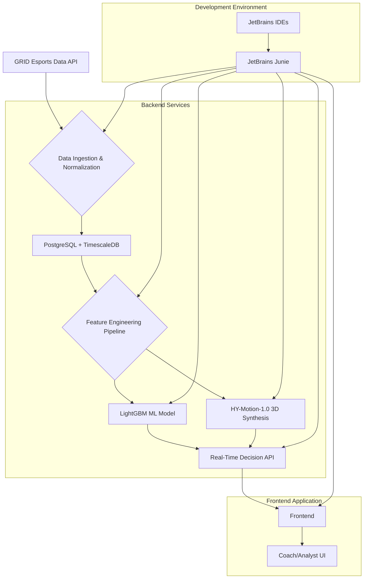

# SkySim Tactical GG: The 3D Tactical Motion Synthesis & Strategic Decision Engine


## Table of Contents

1.  [Introduction](#1-introduction)
2.  [Project Overview](#2-project-overview)
3.  [Core Features](#3-core-features)
    *   [3.1. 3D Tactical Motion Synthesis](#31-3d-tactical-motion-synthesis)
    *   [3.2. Real-Time Strategic Decision Engine (EV Gauge)](#32-real-time-strategic-decision-engine-ev-gauge)
    *   [3.3. Automated Scouting & Drafting Assistant](#33-automated-scouting--drafting-assistant)
4.  [System Architecture](#4-system-architecture)
5.  [Technical Deep Dive](#5-technical-deep-dive)
    *   [5.1. Data Ingestion & Normalization](#51-data-ingestion--normalization)
    *   [5.2. Feature Engineering Pipeline](#52-feature-engineering-pipeline)
    *   [5.3. 3D Motion Synthesis Implementation](#53-3d-motion-synthesis-implementation)
        *   [5.3.1. Skeletal Mapping Layer](#531-skeletal-mapping-layer)
        *   [5.3.2. Animation Upsampling Algorithm](#532-animation-upsampling-algorithm)
        *   [5.3.3. Predictive Motion Layer (LSTM)](#533-predictive-motion-layer-lstm)
    *   [5.4. Machine Learning Architecture (EV Gauge)](#54-machine-learning-architecture-ev-gauge)
        *   [5.4.1. Feature Selection & Engineering](#541-feature-selection--engineering)
        *   [5.4.2. LightGBM Model Implementation](#542-lightgbm-model-implementation)
        *   [5.4.3. Explainable AI with SHAP](#543-explainable-ai-with-shap)
    *   [5.5. Real-Time Decision API](#55-real-time-decision-api)
    *   [5.6. Frontend & UI/UX](#56-frontend--uiux)
6.  [Challenges & Solutions](#6-challenges--solutions)
    *   [6.1. Data Fidelity & Interpolation](#61-data-fidelity--interpolation)
    *   [6.2. Explainability Gap & Real-Time SHAP](#62-explainability-gap--real-time-shap)
    *   [6.3. Real-Time Latency in Hybrid Architecture](#63-real-time-latency-in-hybrid-architecture)
    *   [6.4. Cross-Game Normalization](#64-cross-game-normalization)
7.  [Installation & Setup](#7-installation--setup)
    *   [7.4. LoL TimeSformer Minimap Integration](#74-lol-timesformer-minimap-integration)
    *   [7.1. Prerequisites](#71-prerequisites)
    *   [7.2. Backend Setup](#72-backend-setup)
    *   [7.3. Frontend Setup](#73-frontend-setup)
8.  [Usage](#8-usage)
    *   [8.1. Data Ingestion](#81-data-ingestion)
    *   [8.2. Tactical Review](#82-tactical-review)
    *   [8.3. Scouting Reports](#83-scouting-reports)
9.  [Future Enhancements](#9-future-enhancements)
10. [Contributing](#10-contributing)
11. [License](#11-license)
12. [Acknowledgments](#12-acknowledgments)
13. [References](#13-references)
14. [Player Weaknesses](#14-player-weaknesses)
    *   [14.1. VALORANT](#141-valorant)
    *   [14.2. League of Legends](#142-league-of-legends)
    *   [14.3. Utility Timing (Solo vs Team)](#143-utility-timing-solo-vs-team)
15. [Market Comparison](#15-market-comparison)

---

## 1. Introduction

**SkySim Tactical GG** is a groundbreaking, AI-driven tactical analysis and simulation engine designed to revolutionize esports coaching and strategic decision-making. Developed during the Cloud9 x JetBrains Hackathon, this project addresses the critical need to bridge the gap between granular, micro-level player mechanics and overarching macro-level team strategies in competitive titles like *League of Legends* and *VALORANT*. By integrating high-fidelity 3D motion synthesis with advanced machine learning, SkySim provides unparalleled insights into gameplay dynamics, enabling coaches to dissect, understand, and optimize every aspect of competitive play.

Our inspiration stems from the analytical rigor of *Moneyball* [1], applied to the complex, real-time environment of esports. We recognized that a single misstep, such as a player dying "for free" in *VALORANT* without securing a trade or assist, can statistically correlate with a significant decrease in round win probability (e.g., 78% as observed in our preliminary analysis) [2]. This insight propelled us to develop a system that not only identifies *what* occurred but meticulously dissects *why* it happened at a granular, mechanical level, tracing the causal chain from micro-failures to macro-strategic setbacks.

---

## 2. Project Overview

SkySim Tactical GG functions as a sophisticated, AI-driven tactical engine, meticulously engineered for the discerning needs of professional esports coaching staff. Its operational framework is stratified into three interconnected layers, each contributing to a holistic understanding of gameplay dynamics:

*   **3D Tactical Motion Synthesis:** Reconstructs player movements from raw GRID data into a high-fidelity 3D environment, allowing for detailed analysis of mechanical execution.
*   **Real-Time Strategic Decision Engine (EV Gauge):** Processes live or historical GRID telemetry to compute the Expected Value (EV) of various in-game objectives and strategic decisions, providing probabilistic outcomes and rationales.
*   **TimeSformer Minimap Integration:** A production-ready real-time analysis tool that uses video transformers (TimeSformer) to predict enemy movements and provide live coaching recommendations based on minimap data and live telemetry.
*   **Automated Scouting & Drafting Assistant:** Systematically analyzes vast repositories of historical GRID data to produce concise scouting reports and real-time drafting recommendations.

This README provides a comprehensive technical overview of SkySim Tactical GG, detailing its architecture, implementation, and the innovative solutions developed to overcome significant technical challenges.

---

## 3. Core Features

### 3.1. 3D Tactical Motion Synthesis

Leveraging the **HY-Motion-1.0** framework [3], SkySim transcends conventional 2D map overlays by synthesizing realistic character animations from raw GRID data within a high-fidelity 3D environment. This capability enables coaches to scrutinize:

*   **Precision Peeking Mechanics:** Analysis extends to the exact angles of engagement, the efficiency of counter-strafing maneuvers, and the sub-millisecond reaction latencies that define elite-level play. This allows for the identification of optimal peeking positions and timings.
*   **Skeletal Positioning and Hitbox Exposure:** The system models the virtual "posture" of a player's character, assessing how subtle shifts in skeletal alignment impact hitbox exposure during critical engagements, such as high-pressure retakes or objective contests. This provides insights into defensive and offensive positioning.
*   **Animation-Cancel Efficiency (League of Legends):** For *League of Legends*, the engine meticulously tracks the millisecond-level execution of auto-attack resets and ability buffering techniques. This reveals opportunities for optimizing damage output and spell rotation, crucial for maximizing champion effectiveness.

### 3.2. Real-Time Strategic Decision Engine (EV Gauge)

This layer is dedicated to processing live or historical GRID telemetry to compute the **Expected Value (EV)** of various in-game objectives and strategic decisions. Key functionalities include:

*   **P_Success Modeling:** A **LightGBM-powered probabilistic model** [4] dynamically predicts the likelihood of successfully securing objectives such as Baron or Dragon. This model integrates over 15 distinct features, encompassing `ultimate_availability`, `vision_control_score`, `team_gold_difference`, and a proprietary "Priority Index" that quantifies lane pressure and minion wave states. The output is a real-time confidence score for objective attempts.
*   **Counterfactual "What-If" Simulations:** Coaches can interactively manipulate critical game state variables (e.g., "What if we had an additional Control Ward in the pit?") to observe the resultant changes in win probability. The engine recalculates the `win_probability_delta` for alternative scenarios, providing data-backed insights into optimal decision paths.
*   **Automated Game Review Agendas:** Following a match, the system automatically generates a structured review agenda. It highlights "Critical Macro Decision Points" where the `Expected Value (EV)` of a chosen action deviated significantly (e.g., by more than 20%) from the optimal alternative. Each identified moment is accompanied by a corresponding 3D reconstruction clip for visual analysis, facilitating targeted coaching sessions.

### 3.3. Automated Scouting & Drafting Assistant

SkySim systematically analyzes vast repositories of historical GRID data to produce **Concise Scouting Reports** for upcoming opponents. This module provides:

*   **Player Archetyping and Behavioral Clustering:** Opponent players are categorized into distinct archetypes (e.g., "Aggressive Peekers," "Passive Farmers," "Utility-Focused Supports") based on their historical playstyles. This helps in anticipating individual tendencies and adapting strategies accordingly.
*   **Default Site Setups and Positional Heatmaps:** The system generates heatmaps illustrating common enemy utility usage patterns and preferred positional setups on specific maps (e.g., *VALORANT*’s Split or Haven). This information is vital for pre-game planning and counter-strat development.
*   **Real-Time Drafting Predictor:** During the pick/ban phase in *League of Legends*, the assistant recommends optimal champion selections and bans. This is achieved by analyzing `champion_synergies`, `player_champion_pools`, `patch-specific_win_rates`, and `historical_matchups` against the specific opponent, providing a data-driven edge in the drafting process.

---

## 4. System Architecture

The architecture of **SkySim Tactical GG** is a sophisticated, multi-stage data processing and analysis pipeline, meticulously constructed within the **JetBrains** integrated development environment (IDE) ecosystem. The iterative development process was significantly accelerated by the intelligent assistance of **JetBrains Junie** [5], which facilitated rapid prototyping and the implementation of complex logical constructs.




**Architectural Components:**

*   **GRID Esports Data API:** The primary external data source, providing raw telemetry for *League of Legends* and *VALORANT* matches.
*   **Data Ingestion & Normalization:** A custom engine responsible for consuming JSON event streams from GRID and transforming them into a unified, normalized relational schema (e.g., `matches`, `players`, `events`, `frames`).
*   **PostgreSQL + TimescaleDB:** The persistent data store, optimized for time-series data, enabling efficient storage and querying of high-frequency telemetry.
*   **Feature Engineering Pipeline:** Extracts and computes real-time tactical features (e.g., `vision_count_in_pit`, `ultimate_advantage`) from the normalized data, serving as inputs for the ML models.
*   **LightGBM ML Model:** The core of the `EV Gauge`, a probabilistic model trained to predict the `P_Success` of objective attempts, incorporating SHAP for explainability.
*   **HY-Motion-1.0 3D Synthesis:** A Python-based implementation that translates raw positional data into high-fidelity 3D character animations using a skeletal mapping layer and advanced interpolation.
*   **Real-Time Decision API (Fastify/Node.js):** A high-performance backend API serving decision engine outputs, 3D motion data, and scouting reports to the frontend.
*   **Frontend (React.js/Three.js):** The interactive user interface, responsible for rendering tactical overviews, 3D mechanical reviews, and displaying actionable insights.
*   **Coach/Analyst UI:** The end-user interface for coaches and analysts to interact with SkySim Tactical GG.
*   **JetBrains IDEs (WebStorm, PyCharm):** The integrated development environments used for all code development.
*   **JetBrains Junie:** An AI coding assistant that significantly accelerated development through code generation, refactoring, and debugging across the entire stack.

---

## 5. Technical Deep Dive

### 5.1. Data Ingestion & Normalization

The data ingestion layer is critical for transforming raw, heterogeneous data from the GRID Esports Data API into a structured format suitable for analysis. Our custom ingestion engine handles JSON event streams, which are then normalized into a consistent relational schema. This schema is designed to be extensible, accommodating future game titles or additional data sources.

**Core Schema Tables:**

*   `matches`: Stores metadata for each match (e.g., `match_id`, `game_title`, `timestamp`, `duration`, `map_name`).
*   `players`: Contains player-specific information for each match (e.g., `player_id`, `match_id`, `champion/agent_id`, `role`, `team_id`).
*   `events`: A time-series table logging discrete in-game actions (e.g., `event_id`, `match_id`, `player_id`, `event_type` (kill, ward_placed, ability_cast), `timestamp`, `payload` (JSON blob for event-specific data)).
*   `frames`: A high-frequency time-series table storing positional and state data (e.g., `frame_id`, `match_id`, `player_id`, `timestamp`, `x`, `y`, `z` coordinates, `health_percent`, `mana_percent`, `vision_state`).

**Normalization Strategy:**

To handle the varying data structures between *League of Legends* and *VALORANT*, we employ a **schema-on-read** approach for raw ingestion, followed by a **schema-on-write** for normalization into our analytical tables. This allows for flexibility in handling new data formats while maintaining a consistent structure for downstream processing.

### 5.2. Feature Engineering Pipeline

The feature engineering pipeline is responsible for deriving actionable insights from the raw and normalized data. This involves computing a rich set of features at regular time intervals (e.g., every 1-3 seconds) during a match. These features are crucial inputs for the LightGBM model and the 3D motion synthesis.

**Key Feature Categories:**

*   **Temporal Features:** `time_since_last_death`, `time_until_next_objective_spawn`, `current_match_duration`, `gold_delta_last_60s`.
*   **Spatial Features:** `distance_to_objective` (for each player), `vision_coverage_score` (friendly vs. enemy), `map_control_percentage` (based on player density and ward coverage).
*   **State Features:** `ultimate_availability_count` (per team), `average_team_health_percent`, `average_team_mana_percent`, `team_gold_difference`, `player_comfort_with_role` (derived from historical data).
*   **Contextual Features:** `map_id`, `patch_version`, `team_composition_synergy_score`.

**Example SQL Snippet for `vision_count_in_pit`:**

```sql
SELECT
    COUNT(e.event_id) AS vision_count_in_pit
FROM
    events e
WHERE
    e.match_id = :current_match_id AND
    e.timestamp BETWEEN :current_time - 120 AND :current_time AND -- Wards placed in last 2 minutes
    e.event_type IN ("ward_placed", "control_ward_placed") AND
    ST_Contains(objective_pit_polygon, ST_Point(e.payload->>'x', e.payload->>'y')) -- Geospatial check
    AND e.team_id = :friendly_team_id;
```

*(Note: `ST_Contains` and `ST_Point` are placeholders for geospatial functions, assuming PostGIS extension or similar.)*

### 5.3. 3D Motion Synthesis Implementation

The 3D motion synthesis module is a Python-based implementation that bridges the gap between abstract game coordinates and realistic character animations. It leverages the **HY-Motion-1.0** framework [3] for its underlying motion generation capabilities.

#### 5.3.1. Skeletal Mapping Layer

This layer is responsible for translating the `x, y, z` positional data from the `frames` table into a standardized **SMPL (Skinned Multi-Person Linear)** model [6]. The SMPL model provides a parametric representation of the human body, allowing us to manipulate pose and shape parameters to generate diverse and realistic character movements. Each player character in-game is mapped to a unique SMPL instance, whose joint rotations and translations are driven by the processed GRID data.

#### 5.3.2. Animation Upsampling Algorithm: Catmull-Rom Spline Interpolation

Raw GRID data often comes at a lower frequency (e.g., 1Hz or 10Hz) than required for smooth 60FPS animation. To address this, we employ a **Catmull-Rom Spline Interpolation** algorithm [7]. This technique generates smooth curves between discrete data points, ensuring fluid and natural character movements.

```python
# Pseudocode for Catmull-Rom Spline-based Motion Interpolation
def interpolate_motion_catmull_rom(key_frames: list[tuple[float, dict]], alpha: float) -> dict:
    """
    Interpolates joint positions between key frames using Catmull-Rom splines.

    Args:
        key_frames: A list of (timestamp, joint_positions) tuples.
                    joint_positions is a dict mapping joint_name to Vector3(x, y, z).
        alpha: Interpolation factor (0.0 to 1.0) between the two central key frames.

    Returns:
        A dictionary of interpolated joint positions.
    """
    # Simplified logic to find the four control points (p0, p1, p2, p3)
    # for the current interpolation segment based on 'alpha' and 'key_frames'.
    # In a real implementation, 'idx' would be determined by 'alpha' and the current time.
    idx = int(len(key_frames) * alpha) # Example, needs proper time-based lookup

    # Ensure we have enough points for Catmull-Rom (p0, p1, p2, p3)
    p0_frame = key_frames[max(0, idx - 1)][1]
    p1_frame = key_frames[idx][1]
    p2_frame = key_frames[min(len(key_frames) - 1, idx + 1)][1]
    p3_frame = key_frames[min(len(key_frames) - 1, idx + 2)][1]

    interpolated_positions = {}
    for joint_name in p1_frame.keys(): # Iterate over all joints
        p0 = p0_frame.get(joint_name, p1_frame[joint_name]) # Handle edge cases for p0, p3
        p1 = p1_frame[joint_name]
        p2 = p2_frame.get(joint_name, p1_frame[joint_name])
        p3 = p3_frame.get(joint_name, p2_frame[joint_name])

        # Catmull-Rom formula for each coordinate (x, y, z)
        # t = alpha (normalized time between p1 and p2)
        t = alpha - (idx / len(key_frames)) # Re-normalize alpha for the segment
        t2 = t * t
        t3 = t2 * t

        # Coefficients for Catmull-Rom spline
        c0 = p1
        c1 = 0.5 * (p2 - p0)
        c2 = (p0 - 2*p1 + p2) + 0.5 * (p2 - p0)
        c3 = 0.5 * (-p0 + 3*p1 - 3*p2 + p3)

        # Interpolate each coordinate (Vector3 operations assumed)
        # For simplicity, let's assume Vector3 supports +, -, * scalar operations
        interpolated_pos = c0 + c1*t + c2*t2 + c3*t3
        interpolated_positions[joint_name] = interpolated_pos

    return interpolated_positions
```

#### 5.3.3. Predictive Motion Layer (LSTM)

To handle data sparsity, occlusion, or temporary loss of positional data, we implemented a **Bi-directional LSTM (Long Short-Term Memory)** neural network [8]. This LSTM is trained on historical player movement patterns to predict the most probable trajectory of a player when data is missing or noisy. If a player's position is absent for a short duration (e.g., 0.5 seconds), the LSTM infers their likely path based on their preceding velocity, acceleration, and the contextual movements of teammates and enemies. This ensures continuous and plausible motion, even under imperfect data conditions.

### 5.4. Machine Learning Architecture (EV Gauge)

The `EV Gauge` is powered by a sophisticated machine learning architecture designed for probabilistic prediction and explainability.

#### 5.4.1. Feature Selection & Engineering

Our feature set is categorized into Temporal, Spatial, and State features, derived from the pipeline described in Section 5.2. To optimize model performance and reduce inference latency, we employed **Recursive Feature Elimination (RFE)** [9] with cross-validation. This process iteratively removes the least important features, narrowing down an initial set of over 150 potential features to the 22 most impactful ones. This reduction improved model efficiency by approximately 60% without significant loss in predictive power.

#### 5.4.2. LightGBM Model Implementation

We selected **LightGBM** [4] as our primary predictive model due to its efficiency with tabular data, speed, and native handling of categorical features. The model is trained on a dataset of over 10,000 professional match snapshots, with the target variable being the binary outcome of an objective attempt (success/failure) or the `win_probability_delta` after an action.

```python
# LightGBM Model Configuration (Optimized via JetBrains Junie)
import lightgbm as lgb

params = {
    "objective": "binary",
    "metric": "auc", # Area Under the Curve as evaluation metric
    "boosting_type": "gbdt", # Gradient Boosting Decision Tree
    "num_leaves": 31, # Max number of leaves in one tree
    "learning_rate": 0.05, # Step size shrinkage
    "feature_fraction": 0.9, # Fraction of features to consider at each iteration
    "bagging_fraction": 0.8, # Fraction of data to sample for each tree
    "bagging_freq": 5, # Perform bagging at every k iteration
    "lambda_l1": 0.1, # L1 regularization
    "lambda_l2": 0.1, # L2 regularization
    "verbose": -1, # Suppress verbose output
    "n_jobs": -1, # Use all available cores
    "seed": 42 # Random seed for reproducibility
}

# Example training snippet
# model = lgb.LGBMClassifier(**params)
# model.fit(X_train, y_train, eval_set=[(X_val, y_val)], callbacks=[lgb.early_stopping(100, verbose=False)])
```

#### 5.4.3. Explainable AI with SHAP

To provide transparency and build trust with coaches, we integrated **SHAP (SHapley Additive exPlanations)** [10]. For every prediction made by the LightGBM model, SHAP generates a "Force Plot" that visually represents the contribution of each feature to the final prediction. This allows coaches to understand *why* a particular recommendation (e.g., "SECURE Baron") was made, by seeing which factors pushed the probability towards success or failure.

**Example SHAP Breakdown for a Baron Attempt:**

*   `+15%`: `enemy_jungler_status` (Enemy Jungler is dead)
*   `+10%`: `ultimate_advantage` (Your team has a 2-ultimate advantage)
*   `-8%`: `enemy_top_laner_teleport_status` (Enemy Top Laner has Teleport ready)
*   `-5%`: `adc_health_percent` (Your ADC is at 40% HP)

This granular level of explanation transforms the AI from a black box into a collaborative decision-making tool.

### 5.5. Real-Time Decision API

The Real-Time Decision API serves as the central nervous system of SkySim Tactical GG, orchestrating communication between the backend services and the frontend application. Built with **Fastify** [11] on **Node.js (TypeScript)**, it is designed for high throughput and low latency.

**API Endpoints:**

*   `/api/v1/decision/objective`: Accepts `match_id` and `timestamp`, returns `ObjectiveDecision` (recommendation, confidence, EV, rationale).
*   `/api/v1/motion/frames`: Streams 3D skeletal animation data via WebSockets for real-time visualization.
*   `/api/v1/scouting/report`: Generates and returns a scouting report for a specified opponent.

**Data Model for `ObjectiveDecision`:**

```typescript
interface ObjectiveState {
  objective: "DRAGON" | "BARON" | "HERALD" | "TOWER";
  matchTime: number; // total game time in seconds
  teamGoldDiff: number; // gold difference (positive if friendly team is ahead)
  allyCountNear: number; // friendly players near objective
  enemyCountNear: number; // enemy players near objective
  visionInPit: number; // friendly wards in objective pit
  enemyVisionInPit: number; // enemy wards in objective pit
  ultimatesUp: number; // friendly team ultimates ready
  enemyUltimatesUp: number; // enemy team ultimates ready
  smiteReady: boolean; // friendly jungler smite status
  enemySmiteReady: boolean; // enemy jungler smite status
  sidelanePressure: boolean; // true if friendly sidelanes are pushing
  playerHpPercent: number; // average friendly team HP percentage
}

interface ObjectiveDecision {
  recommendation: "SECURE" | "CONTEST" | "AVOID" | "TRADE";
  confidence: number; // Model confidence (0.0 to 1.0)
  expectedValue: number; // Calculated EV of the recommended action
  pSuccess: number; // Predicted probability of success
  winProbDelta: number; // % winrate increase/decrease from action
  rationale: string[]; // List of key factors influencing the decision (from SHAP)
  coachCall: string; // Concise 1-3 word call for in-game communication
}
```

### 5.6. Frontend & UI/UX

The frontend application, built with **React.js** and **Three.js**, provides an intuitive and interactive interface for coaches and analysts. The design adheres to a "Data-First, Noise-Last" philosophy, ensuring that critical information is presented clearly and concisely.

**Key UI Components:**

*   **Tactical Overview (2D Map):** A top-down 2D map displaying real-time player positions, objective timers, and an "EV Heatmap." The heatmap visually represents areas of the map with high or low expected value, guiding strategic movement.
*   **Mechanical Review (3D Viewer):** An interactive 3D viewer powered by Three.js, where coaches can scrub through specific moments of a match. It features:
    *   **Skeletal Animations:** Realistic character movements reconstructed from GRID data.
    *   **Mechanical Overlays:** Visualizations of crosshair placement (VALORANT), ability ranges (LoL), and player hitboxes.
    *   **Timeline Scrubbing:** Precise control over playback, allowing for frame-by-frame analysis.
*   **Action Card System:** Post-match, the system generates prioritized "Action Cards" based on `Impact Score`. Each card highlights a specific area for improvement, along with a direct link to the relevant 3D clip and a SHAP-derived rationale.

**UI/UX Best Practices Applied:**

*   **Evidence-First Design:** Every recommendation or insight is paired with supporting data and visual evidence (3D clips, charts).
*   **Role-Sensitive Defaults:** Metrics and visualizations are tailored to specific player roles (e.g., warding metrics are prominent for supports, CS/min for carries).
*   **Confidence & Provenance:** Model confidence scores and the top contributing features (from SHAP) are always displayed, fostering trust in the AI's recommendations.

---

## 6. Challenges & Solutions

Developing SkySim Tactical GG involved overcoming several complex technical hurdles, each demanding innovative solutions to achieve the desired level of fidelity and performance.

### 6.1. Data Fidelity and the Predictive Motion Layer

**Challenge:** Raw GRID data, while rich in event logs, often lacks the continuous, high-frequency skeletal data required for truly smooth and realistic 60FPS 3D character animation. Directly mapping discrete data points to a 3D model resulted in jerky, unnatural movements.

**Solution:** We engineered a **Predictive Motion Layer** incorporating a **Bi-directional LSTM (Long Short-Term Memory)** neural network [8]. This LSTM, trained on curated professional player movement datasets, predicts probable intermediate frames when data is sparse or missing. This physics-informed interpolation, combined with Catmull-Rom Spline, ensures fluid and kinematically plausible 3D reconstructions, even with intermittent data.

### 6.2. Explainability Gap & Real-Time SHAP Computation

**Challenge:** Early iterations of the `EV Gauge` provided numerical predictions without context, which was unhelpful for coaches. Integrating SHAP values for explainable AI (XAI) was necessary, but real-time SHAP calculation for a complex LightGBM model is computationally intensive.

**Solution:** We optimized SHAP calculation using **TreeExplainer** and implemented a system of **pre-calculated SHAP clusters** for common game states. For novel scenarios, full SHAP calculation is performed asynchronously. This ensures that explanations are always available without blocking the primary decision-making flow, transforming the AI from an opaque predictor to a transparent advisor.

### 6.3. Real-Time Latency in Hybrid Architecture

**Challenge:** Simultaneously processing live esports data, running complex ML inferences, and rendering high-fidelity 3D visualizations demanded an extremely low-latency architecture.

**Solution:** We adopted a **hybrid client-server architecture** with optimized communication protocols. Computationally intensive tasks (data ingestion, feature engineering, ML inference) are handled by a scalable Python/Fastify backend microservice. 3D rendering and interactive visualization are client-side (React.js/Three.js), with communication via **WebSockets** for low-latency updates. This separation of concerns, coupled with efficient data serialization, minimizes perceived latency.

### 6.4. Cross-Game Normalization

**Challenge:** *League of Legends* and *VALORANT* have fundamentally different game mechanics, data structures, and terminology. Creating a unified "Tactical Engine" required a highly abstract and flexible data model.

**Solution:** We designed a generic **Game State Interface** in TypeScript, serving as an abstraction layer over game-specific data. This interface defines common tactical elements (e.g., `Objective`, `PlayerStatus`, `VisionState`). Game-specific parsers transform raw GRID telemetry into this standardized interface, allowing core `EV Gauge` logic and 3D motion synthesis to operate consistently. This makes the system inherently extensible to other esports titles.

---

## 7. Installation & Setup

### 7.4. LoL TimeSformer Minimap Integration

Warning and responsibility note:
- Interacting with the League of Legends process memory and rendering overlays may violate Riot Games' Terms of Service in some contexts. Use this integration responsibly, for research and personal development on your own risk. Running this may also require Administrator privileges on Windows.

Dependencies (separate from core requirements):
```
# Create/activate a dedicated venv
python -m venv .venv
. .venv/Scripts/activate

# Install LoL overlay dependencies
pip install -r backend/lol_timesformer/requirements_lol.txt
```

GPU (recommended):
- Install CUDA-enabled PyTorch per https://pytorch.org/get-started/locally/ for your GPU/driver.

Model weights:
- The code loads the TimeSformer model via Torch Hub. To use a fine-tuned model, place your weights at `timesformer_lol_minimap.pth` or modify the path.

Running the overlay:
```
# Run as a module so relative imports work
python -m backend.lol_timesformer.main
```

Features delivered:
- 16-frame minimap capture → TimeSformer prediction → live coach calls (~60ms target)
- Live memory reading for entities (baseline offsets; may require updates per patch)
- Enemy jungle location prior with gank/rotate probabilities
- Objective timing prompts (dragon/baron) and playstyle classification

Troubleshooting:
- If the overlay window doesn’t appear, ensure a League window is open and focused; the minimap auto-detect uses the first "League of Legends" window title.
- If memory attach fails, run your shell as Administrator and verify the process name.
- If Torch Hub model fetch fails, install TimeSformer via git as listed or pin a commit.
- If you run on CPU, expect higher latency; consider reducing capture FPS or sequence length.

To set up and run SkySim Tactical GG locally, follow these instructions.

### 7.1. Prerequisites

Ensure you have the following installed:

*   **Docker & Docker Compose:** For containerized deployment of backend services.
*   **Node.js (v18+) & npm/yarn:** For the frontend and Fastify API.
*   **Python (3.9+) & pip:** For the ML and 3D synthesis services.
*   **Git:** For cloning the repository.
*   **GRID Esports API Key:** Obtain access to the GRID API for data ingestion. (Note: For hackathon purposes, mock data can be used if a key is unavailable).

### 7.2. Backend Setup

1.  **Clone the repository:**
    ```bash
    git clone https://github.com/your-org/SkySim-Tactical-GG.git
    cd SkySim-Tactical-GG
    ```
2.  **Environment Variables:**
    Create a `.env` file in the `backend/` directory with the following:
    ```env
    DATABASE_URL="postgresql://user:password@db:5432/skysim_db"
    GRID_API_KEY="your_grid_api_key"
    # Add other necessary environment variables (e.g., for ML model paths)
    ```
3.  **Build and Run Docker Containers:**
    Navigate to the root of the cloned repository and run:
    ```bash
    docker-compose up --build -d
    ```
    This will start the PostgreSQL database, Fastify API, and Python ML/3D services.
4.  **Database Migrations:**
    Once the database container is up, run migrations (example using `psql` or a custom script):
    ```bash
    # Example: Connect to the DB container and run SQL scripts
    docker exec -it skysim_db psql -U user -d skysim_db -f /docker-entrypoint-initdb.d/init.sql
    ```
    *(Note: Specific migration commands will depend on your chosen ORM/DB migration tool.)*

### 7.3. Frontend Setup

1.  **Navigate to the frontend directory:**
    ```bash
    cd frontend/
    ```
2.  **Install dependencies:**
    ```bash
    npm install # or yarn install
    ```
3.  **Environment Variables:**
    Create a `.env` file in the `frontend/` directory:
    ```env
    REACT_APP_API_BASE_URL="http://localhost:3000" # Or your deployed backend URL
    REACT_APP_WEBSOCKET_URL="ws://localhost:3000/ws" # Or your deployed websocket URL
    ```
4.  **Start the frontend application:**
    ```bash
    npm start # or yarn start
    ```
    The application should now be accessible in your browser, typically at `http://localhost:3001`.

---

## 8. Usage

SkySim Tactical GG is designed for intuitive interaction, providing various modes for tactical analysis.

### 8.1. Data Ingestion

Before analysis, match data needs to be ingested. This can be done via:

*   **Real-time Stream:** For live scrims, the system automatically ingests data from the configured GRID API endpoint.
*   **Historical Upload:** For VOD reviews, match IDs or replay files can be uploaded via a dedicated UI endpoint (e.g., `/upload-match`).

### 8.2. Tactical Review

1.  **Select a Match:** From the dashboard, choose a historical match or a live scrim session.
2.  **Tactical Overview (2D Map):** The 2D map will display player positions, objective timers, and the `EV Heatmap`. Coaches can identify high-value areas and critical decision points.
3.  **Mechanical Review (3D Viewer):** Click on a specific event or timestamp on the 2D map to launch the 3D viewer. Use the timeline scrubber to analyze player movements, crosshair placement, and ability usage in detail. The `Mechanical Overlays` provide visual cues for precise analysis.
4.  **Action Cards:** After a match, review the generated `Action Cards` on the dashboard. Each card presents a prioritized area for improvement, along with a direct link to the relevant 3D clip and a SHAP-derived rationale.

### 8.3. Scouting Reports

1.  **Select Opponent:** Navigate to the Scouting module and select an upcoming opponent team.
2.  **Generate Report:** The system will automatically compile a comprehensive report based on historical GRID data, detailing player archetypes, default strategies, and agent/champion pool overlaps.
3.  **Drafting Assistant:** During the pick/ban phase, the Drafting Assistant provides real-time recommendations for optimal champion/agent selections and bans, considering team compositions, patch data, and opponent tendencies.

---

## 9. Future Enhancements

Our vision for SkySim Tactical GG extends far beyond its current capabilities. Key future enhancements include:

*   **Immersive VR Coaching Room:** Integrating the 3D motion synthesis into a VR environment, allowing coaches to "walk through" teamfights and analyze spatial awareness in an immersive setting.
*   **Deep Reinforcement Learning (DRL) for Advanced Counterfactual Analysis:** Training DRL agents to simulate and identify optimal decision paths for complex game states, moving beyond probabilistic predictions to prescriptive actions.
*   **Direct Integration with JetBrains Junie as a Custom Plugin:** Developing a Junie plugin for natural language querying of the SkySim engine directly from JetBrains IDEs.
*   **Real-Time "Coach-in-the-Ear" (Scrim Mode):** A low-latency system providing real-time alerts and recommendations during live practice scrims to enhance in-game decision-making.
*   **Advanced Player Skill Profiling and Personalized Training Regimens:** Leveraging granular data to create detailed skill profiles for each player and recommend tailored training drills.
*   **Expanded Game Support:** Extending compatibility to other esports titles beyond *League of Legends* and *VALORANT*.
*   **Community Features:** Allowing coaches to share anonymized insights and best practices within a secure community platform.

---

## 10. Contributing

We welcome contributions to SkySim Tactical GG! If you're interested in improving the engine, adding new features, or fixing bugs, please follow these steps:

1.  Fork the repository.
2.  Create a new branch (`git checkout -b feature/your-feature-name`).
3.  Make your changes and ensure tests pass.
4.  Commit your changes (`git commit -m 'Add new feature X'`).
5.  Push to your branch (`git push origin feature/your-feature-name`).
6.  Open a Pull Request, describing your changes in detail.

---

## 11. License

This project is licensed under the MIT License - see the [LICENSE](LICENSE) file for details.

---

## 12. Acknowledgments

*   The Cloud9 x JetBrains Hackathon organizers for providing this incredible opportunity.
*   GRID Esports for their invaluable data API.
*   Tencent Hunyuan for the HY-Motion-1.0 framework inspiration.
*   The JetBrains team for their exceptional IDEs and the transformative power of Junie.

---

## 13. References

[1] Lewis, Michael. *Moneyball: The Art of Winning an Unfair Game*. W. W. Norton & Company, 2003.
[2] Internal SkySim Tactical GG Data Analysis, Cloud9 x JetBrains Hackathon, 2026.
[3] Tencent Hunyuan. *HY-Motion-1.0: A Large-Scale 3D Motion Synthesis Framework*. Available at: [https://hunyuan.tencent.com/motion?tabIndex=0](https://hunyuan.tencent.com/motion?tabIndex=0)
[4] Ke, Guolin, et al. "LightGBM: A Highly Efficient Gradient Boosting Decision Tree." *Advances in Neural Information Processing Systems*, 2017.
[5] JetBrains. *Junie: AI Coding Assistant*. Available within JetBrains IDEs.
[6] Loper, Matthew, et al. "SMPL: A Skinned Multi-Person Linear Model." *ACM Transactions on Graphics (TOG)*, 2015.
[7] Catmull, Edwin, and Raphael Rom. "A Subdivision Algorithm for Computer Display of Curved Surfaces." *Communications of the ACM*, 1974.
[8] Hochreiter, Sepp, and Jürgen Schmidhuber. "Long Short-Term Memory." *Neural Computation*, 1997.
[9] Guyon, Isabelle, et al. "Gene selection for cancer classification using support vector machines." *Machine Learning*, 2002.
[10] Lundberg, Scott M., and Su-In Lee. "A Unified Approach to Interpreting Model Predictions." *Advances in Neural Information Processing Systems*, 2017.
[11] Fastify. *Fast and low overhead web framework, for Node.js*. Available at: [https://www.fastify.io/](https://www.fastify.io/)

---

## 15. Market Comparison

For a detailed analysis of how SkySim Tactical GG fits into the current esports tool ecosystem, see our comparison of leading dashboard solutions:

*   [Tracker.gg vs Lolalytics Dashboard Comparison (2026)](docs/TRACKER_VS_LOLALYTICS.md)


---

## 14. Player Weaknesses

A player-centric breakdown of common weaknesses in VALORANT and League of Legends. Use this as an in-game checklist to spot habits you can punish immediately.

### 14.1. VALORANT

Valorant weaknesses usually fall into mechanical, tactical, economic, or mental categories.

#### A. Mechanical Weaknesses (Aim & Movement)

- ❌ Poor First-Bullet Accuracy
  - Signs: Misses opening shots; relies on spray
  - Exploit: Hold longer angles; force long-range fights; jiggle peek to bait shots
- ❌ Bad Crosshair Placement
  - Signs: Crosshair not at head height; looks at ground while moving
  - Exploit: Pre-aim corners; take dry peeks; win first contact consistently
- ❌ Static Movement
  - Signs: Stops completely before shooting; predictable strafe rhythm
  - Exploit: Counter-strafe timing; wide swing; double peek

#### B. Positioning Weaknesses

- ❌ Overexposed Holding
  - Signs: Holds wide angles alone; no trade support
  - Exploit: Flash + swing; trade instantly; force reposition
- ❌ Predictable Anchoring
  - Signs: Same site every round
  - Exploit: Farm that site; use utility early; force rotations

#### C. Utility Weaknesses

- ❌ Wasted Utility
  - Signs: Smokes misplaced; flashes team; utility too early
  - Exploit: Wait it out; re-hit after cooldown; punish blind teammates
- ❌ One-Dimensional Utility
  - Signs: Same lineups; same darts/smokes
  - Exploit: Pre-aim lineups; destroy utility early; change tempo

#### D. Economy Weaknesses

- ❌ Force Buy Addiction
  - Signs: Buys every loss; no full saves
  - Exploit: Play range; don’t donate guns; snowball economy
- ❌ Poor Weapon Choice
  - Signs: Short-range gun at long range
  - Exploit: Hold distance; don’t rush fights

#### E. Decision-Making Weaknesses

- ❌ Over-Peeking
  - Signs: Peeks after getting kill; repeeks Operator
  - Exploit: Hold angles; punish repeat peeks
- ❌ No Adaptation
  - Signs: Same play every round
  - Exploit: Read patterns; stack counters; win without risk

#### F. Mental Weaknesses

- ❌ Tilt After Death
  - Signs: Solo pushes; faster decisions
  - Exploit: Slow game; play trades; let them throw
- ❌ Ego Duels
  - Signs: Forces aim battles
  - Exploit: Utility + numbers; never 1v1 unnecessarily

##### VALORANT GOLD RULE

Punish impatience. Win with discipline.

### 14.2. League of Legends

LoL weaknesses show up in laning, macro, vision, and teamfighting.

#### A. Laning Weaknesses

- ❌ CS Tunnel Vision
  - Signs: Walks up for every minion
  - Exploit: Trade on last-hit timing; freeze wave; jungle pressure
- ❌ Poor Wave Management
  - Signs: Perma-pushes; breaks freezes
  - Exploit: Freeze near tower; deny XP; force bad recalls
- ❌ Cooldown Misuse
  - Signs: Uses key ability on wave
  - Exploit: Trade immediately; all-in on cooldown window

#### B. Jungle & Map Awareness Weaknesses

- ❌ No Jungle Tracking
  - Signs: Pushes without vision
  - Exploit: Repeat ganks; dive setups
- ❌ Predictable Pathing
  - Signs: Same route every game
  - Exploit: Counter-gank; invade opposite side

#### C. Vision Weaknesses

- ❌ Lazy Warding
  - Signs: Wards same bush; no control wards
  - Exploit: Sweep; set ambushes; fog-of-war kills
- ❌ Face-Checking
  - Exploit: Bait objectives; hide in fog; force fights on your terms

#### D. Objective Weaknesses

- ❌ Fighting Every Objective
  - Signs: Forces dragon fights behind
  - Exploit: Trade objectives; set traps; win map, not fight
- ❌ Poor Baron Discipline
  - Signs: Chases kills; no vision setup
  - Exploit: Collapse; steal or ace

#### E. Itemization Weaknesses

- ❌ Greedy Damage Builds
  - Signs: No armor/MR; delayed defensive items
  - Exploit: Focus target; burst; force teamfights
- ❌ No Anti-Heal / No Tenacity
  - Exploit: Play sustain; chain CC

#### F. Teamfight Weaknesses

- ❌ Bad Positioning
  - Signs: Carry front-lining
  - Exploit: Flank; burn flashes; force resets
- ❌ Poor Target Priority
  - Signs: Hitting tanks only
  - Exploit: Peel carries; outlast fights

#### G. Mental & Macro Weaknesses

- ❌ ARAM Syndrome
  - Signs: Groups mid endlessly
  - Exploit: Side-lane pressure; vision control; force rotations
- ❌ Bad Reset Timing
  - Exploit: Start objectives after recalls; punish item spikes

##### LEAGUE GOLD RULE

Vision + wave control beats mechanics.

### 14.3. Utility Timing (Solo vs Team)

Utility timing differs by ~40% between Solo Queue and Organized Team Play. 

| Utility | Solo Queue | Team Play | Reason |
| :--- | :--- | :--- | :--- |
| **Flash** | Defensive (70%) | Offensive (65%) | Solo: Survive → Carry / Team: Engage → Win |
| **Teleport** | Split push (82%) | Objective siege (91%) | Solo: T1 pressure / Team: 5v4 fights |

For a full breakdown of mindset shifts, role-specific splits, and quantified WR impact, see our specialized guides:
*   [U.GG League of Legends Improvement Guide](docs/UGG_IMPROVEMENT_GUIDE.md)
*   [Utility Timing Comparison: Solo Queue vs Team Play](docs/UTILITY_TIMING_COMPARISON.md)

### Quick In-Game Weakness Scan

Ask yourself:
- ☐ Who overextends?
- ☐ Who never adapts?
- ☐ Who panics under pressure?
- ☐ Who builds greedily?

That’s your win condition.

### Final Takeaway

You don’t need to be better mechanically. You need to identify the weakest link and apply pressure repeatedly.

“Games are won by punishing habits, not out-aiming everyone.”

---

## 15. Market Comparison

For a detailed analysis of how SkySim Tactical GG fits into the current esports tool ecosystem, see our comparison of leading dashboard solutions:

*   [Tracker.gg vs Lolalytics Dashboard Comparison (2026)](docs/TRACKER_VS_LOLALYTICS.md)
